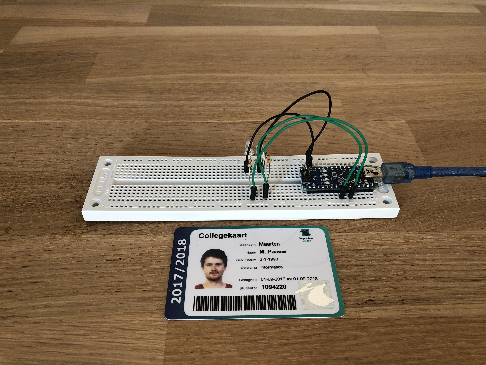
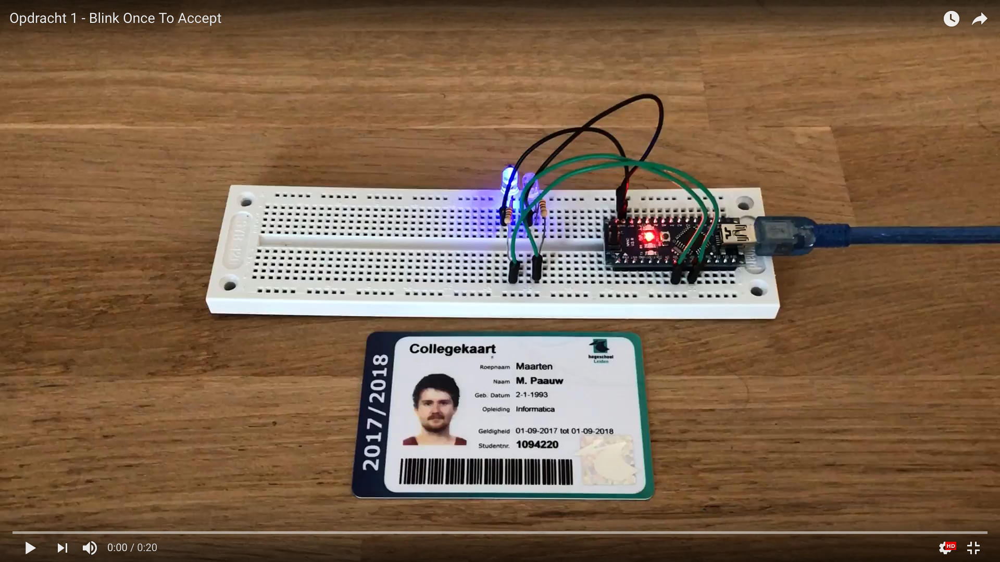
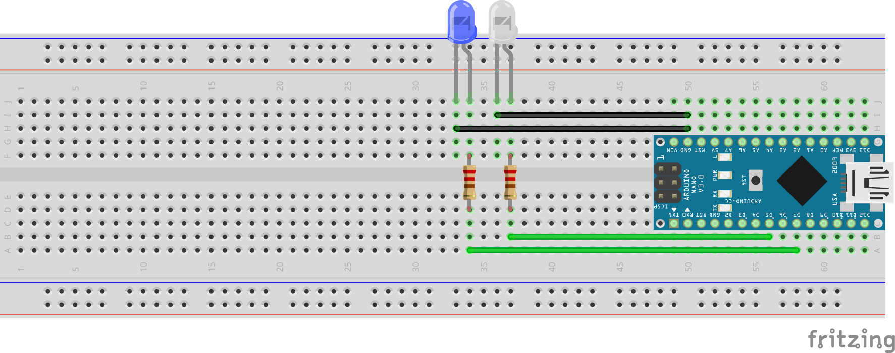

# Opdracht 1

> Blink Once To Accept

Maak een "Blink led" programma, waar twee leds om en om aan en uit gaan. Het knipperen van de leds moet traag verlopen, zodat het knipper-effect zichtbaar is met het blote oog.

## Aanpak en Uitvoering

Omdat ik altijd de editor Visual Studio Code gebruikt wilde ik daar ook mijn opdrachten in gaan maken. Om er voor te zorgen dat dit mogelijk is moet er gebruik gemaakt worden van Platform IO. Platform IO heeft, net zoals in Arduino IDE, voorbeeld *sketches*. Een van de *sketches* is "Native Blink"[^1] (geschreven in C). Deze heb ik geopend, gebuild en geüpload naar mijn Arduino om Platform IO te testen. Deze code zorgt ervoor dat de *onboard* led aan en uit gaat. Deze code heb ik uitgebreid voor mijn opdracht.

## Afbeelding



De afbeelding van de setup kan ook gedownload worden via de volgende link:

[https://raw.githubusercontent.com/maartenpaauw/IMTHE1/master/O1/assets/setup.jpg](https://raw.githubusercontent.com/maartenpaauw/IMTHE1/master/O1/assets/setup.jpg)

## Video

[](https://www.youtube.com/watch?v=_TIATMJMEbU)

Deze video is ook te vinden op **Youtube**:

[https://www.youtube.com/watch?v=_TIATMJMEbU](https://www.youtube.com/watch?v=_TIATMJMEbU)

## Breadboard Schema

[](https://raw.githubusercontent.com/maartenpaauw/IMTHE1/master/O1/assets/fritzing/schema.png)

Het **Fritzing** schema kan ook gedownload worden via de volgende link:

[https://github.com/maartenpaauw/IMTHE1/raw/master/O1/assets/fritzing/schema.fzz](https://github.com/maartenpaauw/IMTHE1/raw/master/O1/assets/fritzing/schema.fzz)

## Code

```c
/*
 * Opdracht 1 - Blink Once To Accept
 * 
 * Maarten Paauw <s1094220@student.hsleiden.nl>
 * s1094220
 * INF3C
 */

#include <avr/io.h>
#include <util/delay.h>

// De main methode
int main(void)
{

    // Defineer dat D5 een output pin is.
    DDRD = 1 << 5;

    // Defineer dat D7 een output pin is.
    DDRD = 1 << 7;

    while (1)
    {
        // Toggle de led op D5.
        PORTD ^= 1 << 5;

        // Wacht voor 1 seconden.
        _delay_ms(1000);

        // Toggle de led op D7.
        PORTD ^= 1 << 7;
    }

    return 0;
}
```

De code kan ook gevonden worden in mijn **GitHub** *repository* via de volgende link:

[https://github.com/maartenpaauw/IMTHE1/blob/master/O1/src/main.c](https://github.com/maartenpaauw/IMTHE1/blob/master/O1/src/main.c)

## Datasheet

Niet van toepassing.

## Bronvermelding

* [https://github.com/platformio/platform-atmelavr/tree/develop/examples/native-blink](^1)

[^1]: https://github.com/platformio/platform-atmelavr/tree/develop/examples/native-blink
