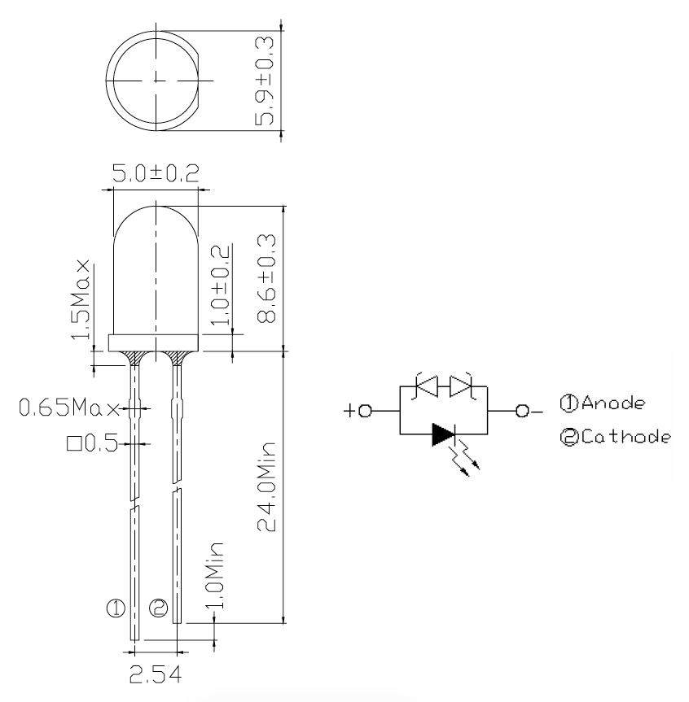

# Opdracht 1

> Blink Once To Accept

Maak een "Blink led" programma, waar twee leds om en om aan en uit gaan. Het knipperen van de leds moet traag verlopen, zodat het knipper-effect zichtbaar is met het blote oog.

## Aanpak en Uitvoering

Omdat ik altijd de editor Visual Studio Code gebruik wilde ik daar ook mijn opdrachten in gaan maken. Om er voor te zorgen dat dit mogelijk is moet er gebruik worden gemaakt van Platform IO. Platform IO heeft, net zoals in Arduino IDE, voorbeeld *sketches*. Een van de *sketches* is ["Native Blink"][2] (geschreven in C). Deze heb ik geopend, gebuild en geüpload naar mijn Arduino om Platform IO te testen. Deze code zorgt ervoor dat de *onboard* led aan en uit gaat. Deze code heb ik uitgebreid voor het voltooien van deze opdracht.

## Afbeelding


De afbeelding van de setup kan ook gedownload worden via de volgende link:

[https://raw.githubusercontent.com/maartenpaauw/IMTHE1/master/O1/assets/setup.jpg](https://raw.githubusercontent.com/maartenpaauw/IMTHE1/master/O1/assets/setup.jpg)

## Video

[](https://www.youtube.com/watch?v=_TIATMJMEbU)

Deze video is ook te vinden op **Youtube**:

[https://www.youtube.com/watch?v=_TIATMJMEbU](https://www.youtube.com/watch?v=_TIATMJMEbU)

## Breadboard Schema

[](https://raw.githubusercontent.com/maartenpaauw/IMTHE1/master/O1/assets/fritzing/schema.png)

Het **Fritzing** schema kan ook gedownload worden via de volgende link:

[https://github.com/maartenpaauw/IMTHE1/raw/master/O1/assets/fritzing/schema.fzz](https://github.com/maartenpaauw/IMTHE1/raw/master/O1/assets/fritzing/schema.fzz)

### Hardware

| Onderdelen               |
| ------------------------ |
| Arduino Nano (v3.0) - 1× |
| 220Ω Resistor - 2×       |
| Dupont kabel - 5×        |
| LED - 2×                 |

## Code

```c
/*
 * Opdracht 1 - Blink Once To Accept
 * 
 * Maarten Paauw <s1094220@student.hsleiden.nl>
 * s1094220
 * INF3C
 */

#include <avr/io.h>
#include <util/delay.h>

// Defineer de pinnen voor de leds.
#define LED_1 PD5
#define LED_2 PD7

// De main functie.
int main(void)
{

    // Defineer dat D5 + D7 een output pin is.
    DDRD = (1 << LED_1) | (1 << LED_2);

    // Loop voor altijd.
    while (1)
    {
        // Toggle de led op D5.
        PORTD ^= (1 << LED_1);

        // Wacht voor 1 seconden.
        _delay_ms(1000);

        // Toggle de led op D7.
        PORTD ^= (1 << LED_2);
    }

    // Geef 0 terug.
    return 0;
}
```

De code kan ook gevonden worden in mijn **GitHub** *repository* via de volgende link:

[https://github.com/maartenpaauw/IMTHE1/blob/master/O1/src/main.c](https://github.com/maartenpaauw/IMTHE1/blob/master/O1/src/main.c)

## Datasheet

### Arduino Nano Pinout


De [Arduino Nano Pinout][1] is uitgedeeld tijdens de eerste les en terug te vinden via het volgende forum post:

[https://forum.arduino.cc/index.php?topic=147582.0][1]

### LED Pinout



De [LED Pinout][3] heb ik gevonden via Google en is terug te vinden via de volgende link:

[https://components101.com/sites/default/files/component_pin/IR-LED-pinout-and-symbol_0.png][3]

## Bronvermelding

* [https://forum.arduino.cc/index.php?topic=147582.0][1] (Arduino Nano Pinout)
* [https://github.com/platformio/platform-atmelavr/tree/develop/examples/native-blink][2] (Native Blink)
* [https://components101.com/sites/default/files/component_pin/IR-LED-pinout-and-symbol_0.png][3] (LED Pinout)

[1]: https://forum.arduino.cc/index.php?topic=147582.0 "Arduino Nano Pinout"
[2]: https://github.com/platformio/platform-atmelavr/tree/develop/examples/native-blink "Native Blink"
[3]: https://components101.com/sites/default/files/component_pin/IR-LED-pinout-and-symbol_0.png "LED Pinout"