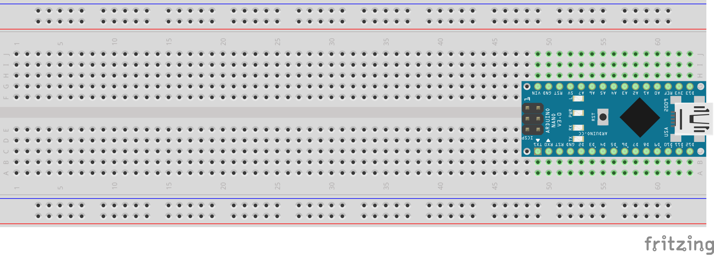

# Opdracht 2

> Count Me In

Deze opdracht bestaat uit drie kleinere opdrachten:

1. Maak een programma dat op het 7-segment LED display herhalend telt van 0 t/m 9. Gebruik het rechter display van de twee en verwerk functies en bit-shifting in je oplossing.
2. Breidt de eerste deel-opdracht uit zodat de twee segmenten samen van 0 t/m 99 tellen.

## Aanpak en Uitvoering

TODO

## Afbeelding


De afbeelding van de setup kan ook gedownload worden via de volgende link:

[https://raw.githubusercontent.com/maartenpaauw/IMTHE1/master/O2/assets/setup.jpg](https://raw.githubusercontent.com/maartenpaauw/IMTHE1/master/O2/assets/setup.jpg)

## Video

[](https://www.youtube.com/)

Deze video is ook te vinden op **Youtube**:

[https://www.youtube.com/](https://www.youtube.com/)

## Breadboard Schema

[](https://raw.githubusercontent.com/maartenpaauw/IMTHE1/master/O2/assets/fritzing/schema.png)

Het **Fritzing** schema kan ook gedownload worden via de volgende link:

[https://github.com/maartenpaauw/IMTHE1/raw/master/O2/assets/fritzing/schema.fzz](https://github.com/maartenpaauw/IMTHE1/raw/master/O2/assets/fritzing/schema.fzz)

### Hardware

| Onderdelen                 |
| -------------------------- |
| Arduino Nano (v3.0) - 1×   |

## Code

```c
/*
 * Opdracht 2 - Count Me In
 * 
 * Maarten Paauw <s1094220@student.hsleiden.nl>
 * s1094220
 * INF3C
 */

#include <avr/io.h>
#include <util/delay.h>

int main(void)
{

    while (1)
    {
        
    }

    return 0;
}
```

De code kan ook gevonden worden in mijn **GitHub** *repository* via de volgende link:

[https://github.com/maartenpaauw/IMTHE1/blob/master/O2/src/main.c](https://github.com/maartenpaauw/IMTHE1/blob/master/O2/src/main.c)

## Datasheet

### Arduino Nano Pinout


De [Arduino Nano Pinout][1] is uitgedeeld tijdens de eerste les en terug te vinden via het volgende forum post:

[https://forum.arduino.cc/index.php?topic=147582.0][1]

## Bronvermelding

* [https://forum.arduino.cc/index.php?topic=147582.0][1] (Arduino Nano Pinout)

[1]: https://forum.arduino.cc/index.php?topic=147582.0 "Arduino Nano Pinout"
