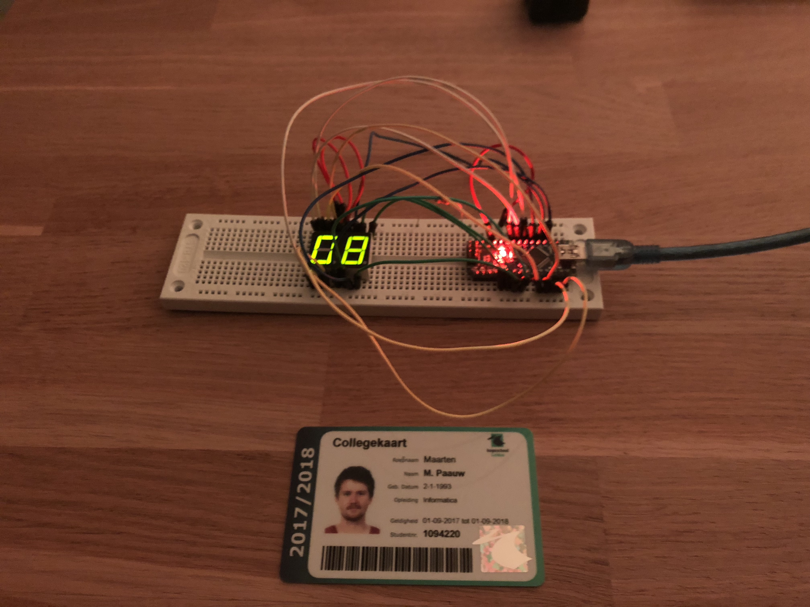
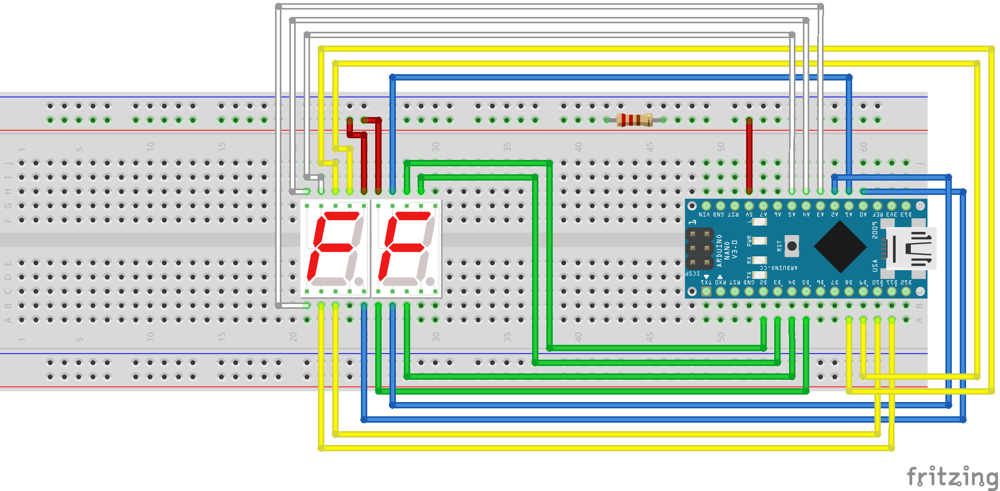
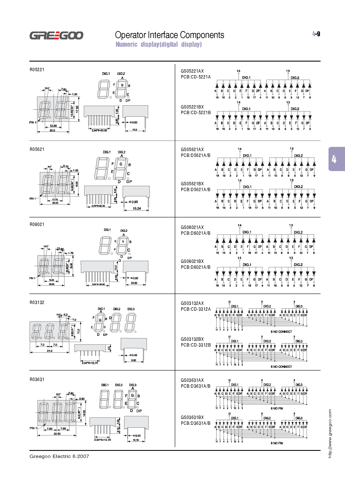

# Opdracht 2.2

> Count Me In

Deze opdracht bestaat uit drie kleinere opdrachten:

1. Maak een programma dat op het 7-segment LED display herhalend telt van 0 t/m 9. Gebruik het rechter display van de twee en verwerk functies en bit-shifting in je oplossing.
2. **Breidt de eerste deel-opdracht uit zodat de twee segmenten samen van 0 t/m 99 tellen.**

## Aanpak en Uitvoering

TODO.

## Afbeelding



De afbeelding van de setup kan ook gedownload worden via de volgende link:

[https://raw.githubusercontent.com/maartenpaauw/IMTHE1/master/O2_2/assets/setup.jpg](https://raw.githubusercontent.com/maartenpaauw/IMTHE1/master/O2_2/assets/setup.jpg)

## Video

[](https://www.youtube.com/watch?v=ND9IHuDUiyA)

Deze video is ook te vinden op **Youtube**:

[https://www.youtube.com/watch?v=ND9IHuDUiyA](https://www.youtube.com/watch?v=ND9IHuDUiyA)

## Breadboard Schema

[](https://raw.githubusercontent.com/maartenpaauw/IMTHE1/master/O2_2/assets/fritzing/schema.png)

Het **Fritzing** schema kan ook gedownload worden via de volgende link:

[https://github.com/maartenpaauw/IMTHE1/raw/master/O2_2/assets/fritzing/schema.fzz](https://github.com/maartenpaauw/IMTHE1/raw/master/O2_2/assets/fritzing/schema.fzz)

### Hardware

| Onderdelen                |
| ------------------------- |
| Arduino Nano (v3.0) - 1×  |
| 220Ω Resistor - 1×        |
| Dupont Kabel - 17×        |
| 7 Segment (D5621A/B) - 1× |


## Code

```c
/*
 * Opdracht 2.2 - Count Me In
 * 
 * Maarten Paauw <s1094220@student.hsleiden.nl>
 * s1094220
 * INF3C
 */

/*
 * LEFT DIGIT
 *
 * PB0 = A = 16
 * PB1 = B = 15
 * PB2 = C = 3
 * PB3 = D = 2
 * 
 * PC3 = E = 1
 * PC4 = F = 18
 * PC5 = G = 17
 */

/*
 * RIGHT DIGIT
 *
 * PD2 = A = 11
 * PD3 = B = 10
 * PD4 = C = 8
 * PD5 = D = 6
 * 
 * PC0 = E = 5
 * PC1 = F = 12
 * PC2 = G = 7
 */

#include <avr/io.h>
#include <util/delay.h>


// Regel de B pinnen.
void handleB (int right) {
    // 0b00111111
    // 0b11110000
    // 0b00001111 <- uitkomst voor 0.
    PORTB =~ ((right << 4) >> 4);
}

// Regel de C pinnen.
void handleC (int left, int right) {
    // Left
    // 0b00111111
    // 0b01111110
    // 0b00011000 <- uitkomst voor de linker 0.
    //
    // Right
    // 0b00111111
    // 0b01111110
    // 0b00000011 <- uitkomst voor de rechter 0.
    //
    // 0b00011000
    // 0b00000011 |
    // ----------
    // 0b00011011 <- uitkomst voor 0.
    PORTC =~ ((((left << 1) >> 5) << 3) | ((right << 1) >> 5));
}

// Regel de D pinnen.
void handleD (int left) {
    // 0b00111111
    // 0b11110000
    // 0b00111100 <- uitkomst voor 0.
    PORTD =~ ((left << 4) >> 2);
}

int main(void)
{
    // Segmenten als binair getal voor de cijfers 0 t/m 9.
    int numbers[10] = {
        // GFEDCBA
        0b00111111, // 0
        0b00000110, // 1
        0b01011011, // 2
        0b01001111, // 3
        0b01100110, // 4
        0b01101101, // 5
        0b01111101, // 6
        0b00000111, // 7
        0b01111111, // 8
        0b01101111  // 9
    };

    // Count
    int a = 0;

    // Zet de B pinnen op output.
    DDRB = 0b00001111;

    // Zet de C pinnen op output.
    DDRC = 0b00111111;

    // Zet de D pinnen op output.
    DDRD = 0b00111100;

    while (1)
    {
        int left  = numbers[a / 10];
        int right = numbers[a % 10];

        // Regel de B pinnen.
        handleB(left);

        // Regel de C pinnen.
        handleC(left, right);

        // Regel de D pinnen.
        handleD(right);

        // Wacht 1 seconden.
        _delay_ms(1000);

        // Tel de A op.
        a++;

        // Reset de count.
        if (a > 99) {
            a = 0;
        }
    }

    return 0;
}
```

De code kan ook gevonden worden in mijn **GitHub** *repository* via de volgende link:

[https://github.com/maartenpaauw/IMTHE1/blob/master/O2_2/src/main.c](https://github.com/maartenpaauw/IMTHE1/blob/master/O2_2/src/main.c)

## Datasheet

### Arduino Nano Pinout


De [Arduino Nano Pinout][1] is uitgedeeld tijdens de eerste les en terug te vinden via het volgende forum post:

[https://forum.arduino.cc/index.php?topic=147582.0][1]

### 7 Segment Display Pinout



De 7 Segment Display pinout heb ik gevonden op het internet via de volgende link:

[http://www.datasheetarchive.com/pdf/download.php?id=2e413cb5ea82e53f65ba9873ced61ae74e9e4a&type=P&query=A%2Fd5621A%2FB][2]

## Bronvermelding

* [https://forum.arduino.cc/index.php?topic=147582.0][1] (Arduino Nano Pinout)
* [http://www.datasheetarchive.com/pdf/download.php?id=2e413cb5ea82e53f65ba9873ced61ae74e9e4a&type=P&query=A%2Fd5621A%2FB][2] (7 Segment Display (D5621A/B) Datasheet)
* [https://en.wikipedia.org/wiki/Seven-segment_display][3] (7 Segment Display)

[1]: https://forum.arduino.cc/index.php?topic=147582.0 "Arduino Nano Pinout"
[2]: http://www.datasheetarchive.com/pdf/download.php?id=2e413cb5ea82e53f65ba9873ced61ae74e9e4a&amp;amp;amp;amp;amp;type=P&amp;amp;amp;amp;amp;query=A%2Fd5621A%2FB "7 Segment Display (D5621A/B) Datasheet"
[3]: https://en.wikipedia.org/wiki/Seven-segment_display "7 Segment Display"
