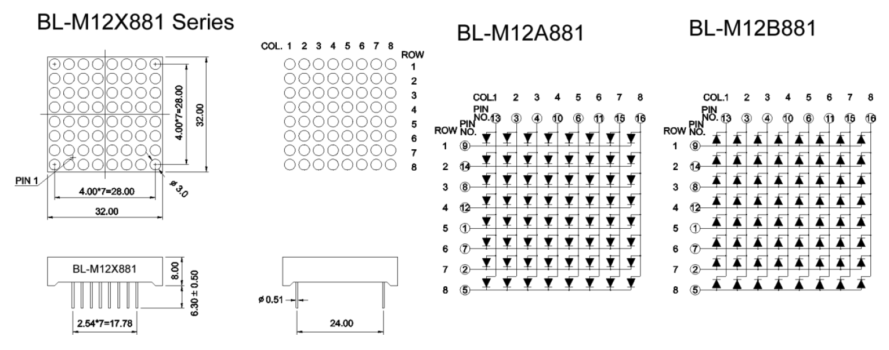

# Opdracht 3.1

> ADC Baby!

Deze opdracht bestaat uit twee kleinere opdrachten:

1. **Maak een digitale dobbelsteen met 9 leds (zie plaatje). Als je op een knop drukt geven de leds een random waarde tussen 1 en 6 weer op de leds zoals je dat kent op een echte dobbelsteen. Hou bij het programma rekening met dender-gedrag.** 
2. Maak een programma dat de waarde van een potentiometer vertaalt in een geluidssignaal tussen 100 en 10.000Hz. Laat dit signaal horen op de speaker.


## Aanpak en Uitvoering

Tijdens de les van week 3 zijn wij bezig geweest met de push button en 1 led. Als de knop ingedrukt werd ging de led aan en als de knop weer werd losgelaten ging de led uit. Deze code heb ik verder uitgebreid om deze opdracht te halen. 

In plaats van dat ik gebruik maak van 9 led's heb ik ervoor gekozen om het 8×8 matrix te gebruiken. Een oog van de dobbelsteen is 2×2 op het matrix. Zo hou je tussen de ogen één enkele led over. Om ervoor te zorgen dat er maar één oog aangaat staat elke oog, ook al zijn er meerdere nodig, 1 miliseconden aan. Dit is niet te zien met het blote oog.

In het hoofdstuk datasheet is er een datasheet opgenomen waarbij ik aangegeven heb welke LED's ik nodig heb en welke niet. Hieronder een tabel met welke pinnen ik nodig heb.

### 8×8 Matrix Pinnen

| Rijen | Kolommen |
| ----- | -------- |
| 9     | 13       |
| 14    | 3        |
| 12    | 10       |
| 1     | 6        |
| 2     | 15       |
| 5     | 16       |

*De pinnen zijn gesorteerd van links naar rechts op het component.*

## Afbeelding


De afbeelding van de setup kan ook gedownload worden via de volgende link:

[https://raw.githubusercontent.com/maartenpaauw/IMTHE1/master/O3_1/assets/setup.jpg](https://raw.githubusercontent.com/maartenpaauw/IMTHE1/master/O3_1/assets/setup.jpg)

## Video

[](https://www.youtube.com/watch?v=kApDEr8afI4)

Deze video is ook te vinden op **Youtube**:

[https://www.youtube.com/watch?v=kApDEr8afI4](https://www.youtube.com/watch?v=kApDEr8afI4)

## Breadboard Schema

[](https://raw.githubusercontent.com/maartenpaauw/IMTHE1/master/O3_1/assets/fritzing/schema.png)

Het **Fritzing** schema kan ook gedownload worden via de volgende link:

[https://github.com/maartenpaauw/IMTHE1/raw/master/O3_1/assets/fritzing/schema.fzz](https://github.com/maartenpaauw/IMTHE1/raw/master/O3_1/assets/fritzing/schema.fzz)

### Hardware

| Onderdelen               |
| ------------------------ |
| Arduino Nano (v3.0) - 1× |
| 220Ω Resistor - 6×       |
| Push Button - 1×         |
| 8×8 Matrix - 1×          |
| Dupont kabels - 26×      |

## Code

```c
/*
 * Opdracht 3.1 - ADC Baby!
 * 
 * Maarten Paauw <s1094220@student.hsleiden.nl>
 * s1094220
 * INF3C
 */

#include <avr/io.h>
#include <util/delay.h>
#include <stdlib.h>

// Genereer een random nummer tussen 1 en 6.
int dobbel()
{
    // Genereer een random nummer tussen 1 en 6.
    return (rand() % 6) + 1;
}

// Regel de pinnen op de C bank.
void handleC(int number)
{
    // Regel de pinnen op de C bank.
    PORTC = ~number;
}

// Regel de pinnen op de D bank.
void handleD(int number)
{

    // Door de RX en TX pinnen begin ik pas op pin D2.
    // Daarom wordt er even 2x naar links gebitshift.
    PORTD = (number << 2);
}

// Zet alle poorten uit.
void clear()
{
    // Zet alle pinnen op de C bank op 0.
    PORTC = 0b0000000;

    // Zet alle pinnen op de D bank op 0.
    PORTD = 0b0000000;
}

// Functie voor een enkel oog.
void dot(int number)
{
    // Het getal min 1 voor de index uit de array.
    number = number - 1;

    // Alle 9 ogen met de daarbij behorende pinnen.
    int dots[9][2] = {
        {0b00000011, 0b00000011}, // LINKS    BOVEN
        {0b00001100, 0b00000011}, // MIDDEN   BOVEN
        {0b00110000, 0b00000011}, // RECHTS   BOVEN
        {0b00000011, 0b00001100}, // LINKS    MIDDEN
        {0b00001100, 0b00001100}, // MIDDEN   MIDDEN
        {0b00110000, 0b00001100}, // RECHTS   MIDDEN
        {0b00000011, 0b00110000}, // LINKS    ONDER
        {0b00001100, 0b00110000}, // MIDDEN   ONDER
        {0b00110000, 0b00110000}  // RECHTS   ONDER
    };

    // Zet de C pinnen aan.
    handleC(dots[number][0]);

    // Zet de D pinnen aan.
    handleD(dots[number][1]);
}

// Functie voor een enkele zijde.
void side(int number)
{

    // Alle zijdes van een dobbelsteen met welke ogen er nodig zijn.
    int sides[6][6] = {
        {5},               // 1
        {1, 9},            // 2
        {1, 5, 9},         // 3
        {1, 3, 7, 9},      // 4
        {1, 3, 5, 7, 9},   // 5
        {1, 3, 4, 6, 7, 9} // 6
    };

    // Loop door de ogen heen.
    for (int i = 0; i < number; i++)
    {
        // Zet alle pinnen uit.
        clear();

        // Zet de dot aan.
        dot(sides[number - 1][i]);

        // Wacht voor 1 miliseconden.
        _delay_ms(1);
    }
}

// De main functie.
int main(void)
{
    // Zet de B pinnen op input.
    PORTB = (1 << PB0);

    // Zet de C pinnen op output.
    DDRC = 0b00111111;

    // Zet de D pinnen op output.
    DDRD = 0b11111100;

    // Toon standaard 1.
    int res = 1;

    // Loop voor altijd.
    while (1)
    {
        // Controleer of de knop is ingedrukt.
        if (bit_is_clear(PINB, PB0))
        {

            // Genereer een random getal.
            res = dobbel();

            // Leeg het display.
            clear();

            // Loop net zolang dat de button losgelaten is.
            loop_until_bit_is_set(PINB, PB0);
        }

        // Toon het resultaat.
        side(res);
    }

    // Geef een 0 terug.
    return 0;
}
```

De code kan ook gevonden worden in mijn **GitHub** *repository* via de volgende link:

[https://github.com/maartenpaauw/IMTHE1/blob/master/O3_1/src/main.c](https://github.com/maartenpaauw/IMTHE1/blob/master/O3_1/src/main.c)

## Datasheet

### Arduino Nano Pinout


De [Arduino Nano Pinout][1] is uitgedeeld tijdens de eerste les en terug te vinden via het volgende forum post:

[https://forum.arduino.cc/index.php?topic=147582.0][1]

### 8×8 Matrix Pinout



De [8×8 Matrix Pinout][2] is terug te vinden via de volgende link:

[https://www.arduino.cc/en/Tutorial/RowColumnScanning][2]


Voor het gemak heb ik voor mijzelf de pinnen gefilterd en met kleur aangegeven welke ik nodig heb (groen) en welke niet (rood).

## Bronvermelding

* [https://forum.arduino.cc/index.php?topic=147582.0][1] (Arduino Nano Pinout)
* [https://www.arduino.cc/en/Tutorial/RowColumnScanning][2] (8×8 Matrix Pinout)

[1]: https://forum.arduino.cc/index.php?topic=147582.0 "Arduino Nano Pinout"
[2]: https://www.arduino.cc/en/Tutorial/RowColumnScanning "8×8 Matrix Pinout"
