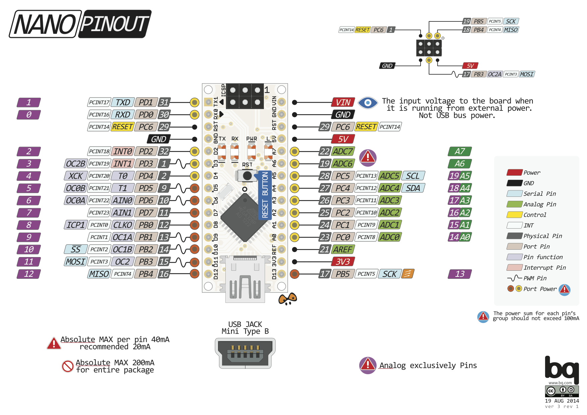

# Opdracht 3.2

> ADC Baby!

Deze opdracht bestaat uit twee kleinere opdrachten:

1. Maak een digitale dobbelsteen met 9 leds (zie plaatje). Als je op een knop drukt geven de leds een random waarde tussen 1 en 6 weer op de leds zoals je dat kent op een echte dobbelsteen. Hou bij het programma rekening met dender-gedrag. 
2. **Maak een programma dat de waarde van een potentiometer vertaalt in een geluidssignaal tussen 100 en 10.000Hz. Laat dit signaal horen op de speaker.**


## Aanpak en Uitvoering

| Hz (hertz) | ms (milliseconds) | µs (microseconds) |
| ---------- | ----------------- | ----------------- |
| 100        | 10                | 10.000            |
| 10.000     | 0.1               | 100               |

## Afbeelding


De afbeelding van de setup kan ook gedownload worden via de volgende link:

[https://raw.githubusercontent.com/maartenpaauw/IMTHE1/master/O3_2/assets/setup.jpg](https://raw.githubusercontent.com/maartenpaauw/IMTHE1/master/O3_2/assets/setup.jpg)

## Video

[](https://www.youtube.com/)

Deze video is ook te vinden op **Youtube**:

[https://www.youtube.com/](https://www.youtube.com/)

## Breadboard Schema

[](https://raw.githubusercontent.com/maartenpaauw/IMTHE1/master/O3_2/assets/fritzing/schema.png)

Het **Fritzing** schema kan ook gedownload worden via de volgende link:

[https://github.com/maartenpaauw/IMTHE1/raw/master/O3_2/assets/fritzing/schema.fzz](https://github.com/maartenpaauw/IMTHE1/raw/master/O3_2/assets/fritzing/schema.fzz)

### Hardware

| Onderdelen                 |
| -------------------------- |
| Arduino Nano (v3.0) - 1×   |

## Code

```c
/*
 * Opdracht 3.2 - ADC Baby!
 * 
 * Maarten Paauw <s1094220@student.hsleiden.nl>
 * s1094220
 * INF3C
 */

#include <avr/io.h>
#include <util/delay.h>
#include <math.h>

// Initialiseer de potential meter.
void initADC () {
    
    // Zet op 5 volt.
    ADMUX  |= (1 << REFS0);
    
    // Divider op 128 voor 10 bit precisie.
    ADCSRA |= ((1 << ADPS0) | (1 << ADPS1) | (1 << ADPS2));
    
    // AD enable.
    ADCSRA |= (1 << ADEN);
}

// Lees de potential meter.
uint16_t readADC () {
    
    // Starten met lezen.
    ADCSRA |= (1 << ADSC);
    
    // Loop totdat er een waarde is.
    loop_until_bit_is_clear(ADCSRA, ADSC);
    
    // Geef de waarde terug.
    return ADC;
}

// Dynamische timeout.
void delay (uint16_t time) {

    // For loop.
    for (uint16_t i = 0; i < time; i++) {

        // Wacht voor 1 ms.
        _delay_us(1);
    }
}

// Preciezere afronden.
// https://stackoverflow.com/questions/5731863/mapping-a-numeric-range-onto-another
double round (double d) {

    // Tel er 0.5 bij op en rond het getal af.
    return floor(d + 0.5);
}

// Map het getal van een range in een nieuwe range.
// https://stackoverflow.com/questions/5731863/mapping-a-numeric-range-onto-another
double map (int input, int input_start, int input_end, int output_start, int output_end) {
    
    // Defineer de slope.
    double slope = 1.0 * (output_end - output_start) / (input_end - input_start);

    // Geef het nieuwe getal terug.
    return output_start + round(slope * (input - input_start));
}

int main(void)
{
    // B Bank initialiseren.
    DDRB  = (1 << PB5);

    // Initialiseer de potential meter.
    initADC();

    // Loop voor altijd.
    while (1)
    {
        // Lees de waarde van de potential meter uit.
        uint16_t pwm = readADC();

        // Zet de B pin aan.
        PORTB = (1 << PB5);

        // Wacht voor 1 ms.
        _delay_ms(1);

        // Zet de B pin uit.
        PORTB = 0;

        // Wacht voor een X aantal µs.
        delay(map(pwm, 1, 1024, 10000, 100));
    }

    return 0;
}
```

De code kan ook gevonden worden in mijn **GitHub** *repository* via de volgende link:

[https://github.com/maartenpaauw/IMTHE1/blob/master/O3_2/src/main.c](https://github.com/maartenpaauw/IMTHE1/blob/master/O3_2/src/main.c)

## Datasheet

### Arduino Nano Pinout



De [Arduino Nano Pinout][1] is uitgedeeld tijdens de eerste les en terug te vinden via het volgende forum post:

[https://forum.arduino.cc/index.php?topic=147582.0][1]

### RS 7243119 Pinout


De [RS 7243119 Pinout][2] heb ik gevonden in de specificaties bij een webshop en is terug te vinden via de volgende url:

[https://www.alliedelec.com/m/d/69ca74a806a82d744141c552ce43700a.pdf][2]

## Bronvermelding

* [https://forum.arduino.cc/index.php?topic=147582.0][1] (Arduino Nano Pinout)
* https://www.alliedelec.com/m/d/69ca74a806a82d744141c552ce43700a.pdf (RS 7243119 Pinout)

[1]: https://forum.arduino.cc/index.php?topic=147582.0 "Arduino Nano Pinout"
[2]: https://www.alliedelec.com/m/d/69ca74a806a82d744141c552ce43700a.pdf "RS 7243119"
