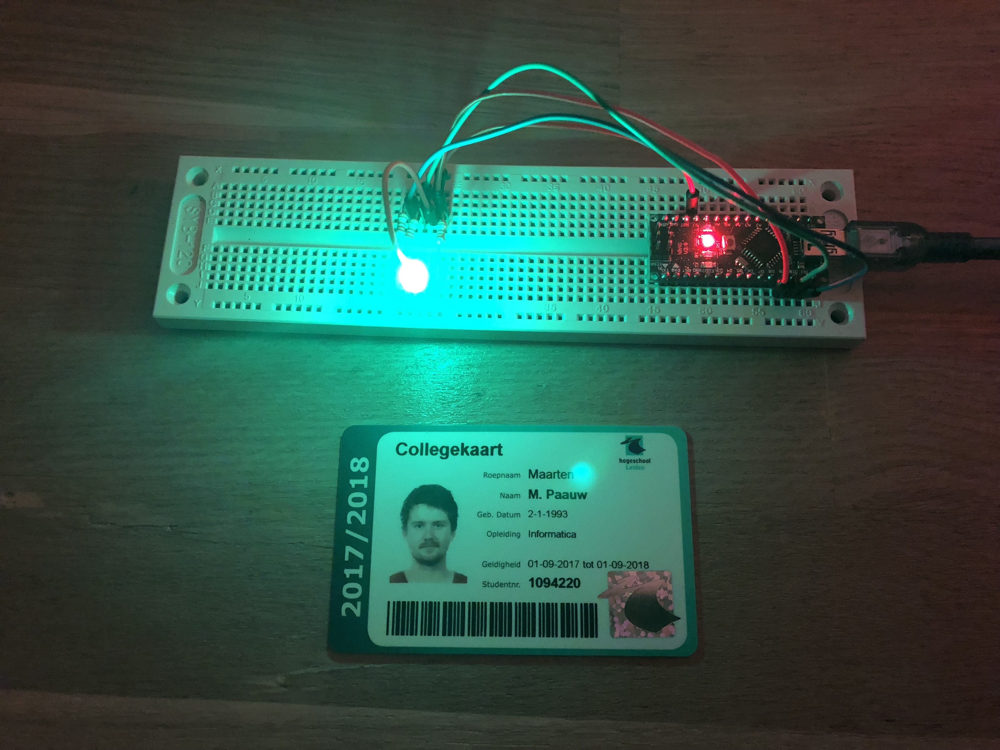
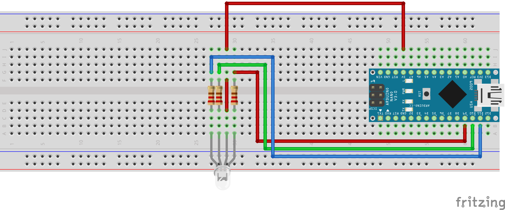
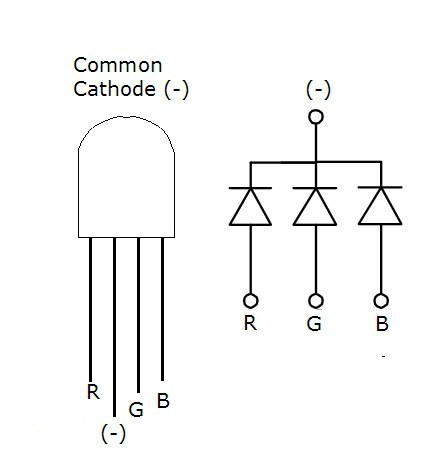

# Opdracht 4.1

> Led There Be Light

Deze opdracht bestaat uit drie kleinere opdrachten:

1. **Creëer een ‘Color changing light’ met het RGB-led op basis van PWM. De PWM moet in een Interrupt Service Routine (ISR) worden afgehandeld.**
2. Maak een programma waarin je via Serial communicatie een led aan of uit kan zetten. Dit mag door bijvoorbeeld het karakter ‘a’ of ‘u’ te sturen. Het programma geeft feedback over de seriële poort of het gelukt is ja of nee. Gebruik niet de gegeven usart.c en .h in je uitwerking, maar maak een oplossing in 1 source bestand.
3. Verander deelopdracht 2 zodat binnenkomende data afgehandeld wordt in een interrupt (USART_RX_vect) zodat je programma (zoals in het voorbeeld van hoofdstuk 5) niet ‘eeuwig’ op input wacht. Toon aan dat het werkt door via seriële communicatie een ‘r’, ‘g’ of ‘b’ door te geven aan de AVR en dat dan de corresponderende kleur gaat pulseren (PWM op 1 kleur).

## Aanpak en Uitvoering

Code uit de les verder uitgewerkt.

#### LED soort uitzoeken

Uitleg.

#### Code uit boek

Uitleg.

## Afbeelding



De afbeelding van de setup kan ook gedownload worden via de volgende link:

[https://raw.githubusercontent.com/maartenpaauw/IMTHE1/master/O4_1/assets/setup.jpg](https://raw.githubusercontent.com/maartenpaauw/IMTHE1/master/O4_1/assets/setup.jpg)

## Video

[](https://www.youtube.com/watch?v=dClmJYRgYDM)

Deze video is ook te vinden op **Youtube**:

[https://www.youtube.com/watch?v=dClmJYRgYDM](https://www.youtube.com/watch?v=dClmJYRgYDM)

## Breadboard Schema

[](https://raw.githubusercontent.com/maartenpaauw/IMTHE1/master/O4_1/assets/fritzing/schema.png)

Het **Fritzing** schema kan ook gedownload worden via de volgende link:

[https://github.com/maartenpaauw/IMTHE1/raw/master/O4_1/assets/fritzing/schema.fzz](https://github.com/maartenpaauw/IMTHE1/raw/master/O4_1/assets/fritzing/schema.fzz)

### Hardware

| Onderdelen               |
| ------------------------ |
| Arduino Nano (v3.0) - 1× |
| RGB LED - 1×             |
| 220Ω Resistor - 3×       |
| Dupont kabel - 5×        |

## Code

```c
/*
 * Opdracht 4.1 - Led There Be Light
 * 
 * Maarten Paauw <s1094220@student.hsleiden.nl>
 * s1094220
 * INF3C
 */

#include <avr/io.h>
#include <avr/delay.h>
#include <avr/interrupt.h>

// LED pinnen.
#define LED_RED PB1
#define LED_GREEN PB2
#define LED_BLUE PB3

// RGB waardes.
int RGB[3] = {255, 0, 0};

// Rood als decrement.
int dec = 0;

// Groen als increment.
int inc = 1;

ISR(TIMER0_OVF_vect)
{
    // Trek R, G of B af.
    RGB[dec] -= 1;

    // Tel R, G of B af.
    RGB[inc] += 1;

    // Als de waarde van R, G of B helemaal terug is op 0.
    if (RGB[dec] <= 0)
    {
        // Tel op.
        dec++;
        inc++;

        // Als de decrement groter dan 2 wordt.
        if (dec > 2)
        {
            // Reset de opteller.
            dec = 0;
        }

        // Als de increment groter dan 2 wordt.
        if (inc > 2)
        {
            // Reset de opteller.
            inc = 0;
        }
    }

    else
    {
        // Rode led waarde.
        OCR1A = ~RGB[0];

        // Groene led waarde.
        OCR1B = ~RGB[1];

        // Blauwe led waarde.
        OCR2A = ~RGB[2];
    }
}

void initTimerOverflow()
{
    // Timer mask.
    TIMSK0 |= (1 << TOIE0);

    // Timer instellingen.
    TCCR0B |= (1 << CS02) | (1 << CS00);
    sei();
}

void intPWMTimerLED()
{
    // Timer 1 (Voor rood en groen).
    TCCR1A |= (1 << WGM10) | (1 << WGM12); // Fast PWM.
    TCCR1B |= (1 << CS11);                 // PWM freq.

    // Timer 2 (Voor blauw).
    TCCR2A |= (1 << WGM20) | (1 << WGM21); // Fast PWM.
    TCCR2B |= (1 << CS21);                 // PWM freq.

    // Rode led.
    TCCR1A |= (1 << COM1A1);

    // Groene led.
    TCCR1A |= (1 << COM1B1);

    // Blauwe led.
    TCCR2A |= (1 << COM2A1);
}

// Main fucntie.
int main(void)
{

    // Initialiseer de RGB LED pinnen.
    DDRB = ((1 << LED_RED) | (1 << LED_GREEN) | (1 << LED_BLUE));

    // Initialiseer de overflow timer.
    initTimerOverflow();

    // Initialiseer de led timer.
    intPWMTimerLED();

    // Loop voor altijd.
    while (1)
    {
    }

    // Geef 0 terug.
    return 0;
}
```

De code kan ook gevonden worden in mijn **GitHub** *repository* via de volgende link:

[https://github.com/maartenpaauw/IMTHE1/blob/master/O4_1/src/main.c](https://github.com/maartenpaauw/IMTHE1/blob/master/O4_1/src/main.c)

## Datasheet

### Arduino Nano Pinout


De [Arduino Nano Pinout][1] is uitgedeeld tijdens de eerste les en terug te vinden via het volgende forum post:

[https://forum.arduino.cc/index.php?topic=147582.0][1]

### RGB LED (Common Cathode) Pinout



De [RGB LED (Common Cathode) Pinout][2] heb ik gevonden op het internet door te Googelen op afbeeldingen en kan terug gevonden worden via de volgende link:

[https://i1.wp.com/wiki.jmoon.co/wp-content/uploads/2015/07/rgb-2.jpg][2]

## Bronvermelding

* [https://forum.arduino.cc/index.php?topic=147582.0][1] (Arduino Nano Pinout)
* [https://i1.wp.com/wiki.jmoon.co/wp-content/uploads/2015/07/rgb-2.jpg][1] (RGB LED (Common Cathode) Pinout)

[1]: https://forum.arduino.cc/index.php?topic=147582.0 "Arduino Nano Pinout"
[2]: https://i1.wp.com/wiki.jmoon.co/wp-content/uploads/2015/07/rgb-2.jpg "RGB LED (Common Cathode) Pinout"
