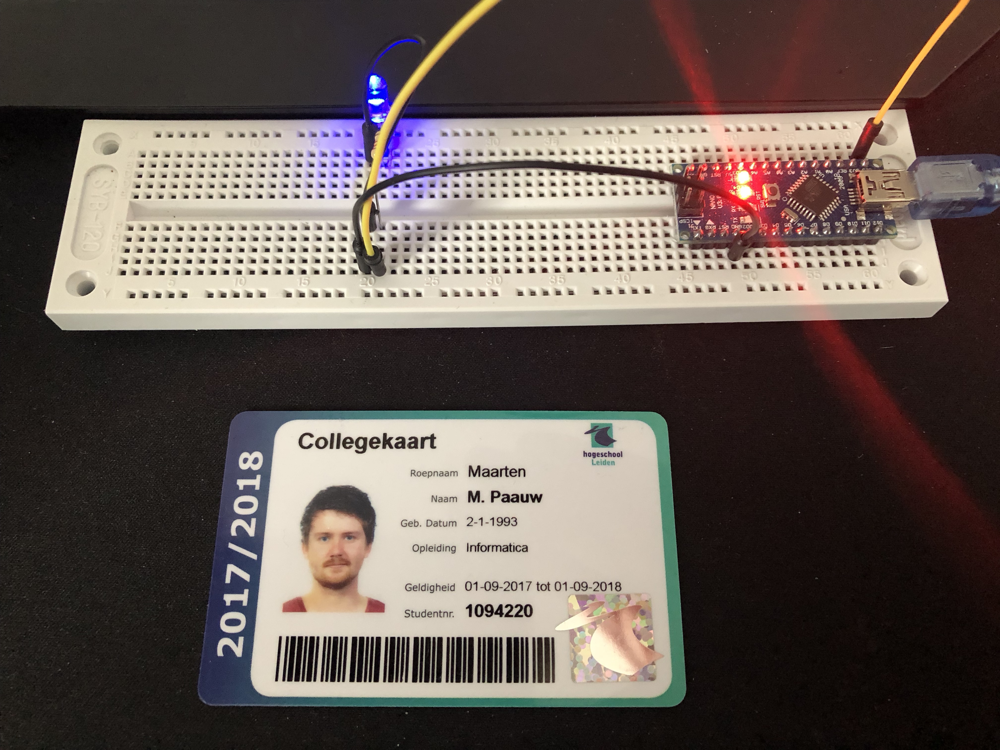
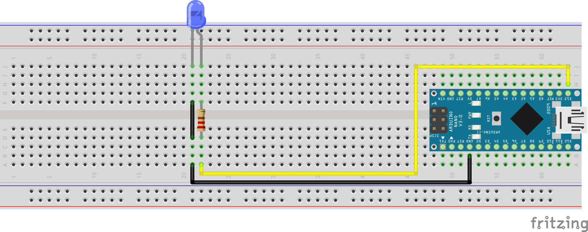

# Opdracht 4.2

> Led There Be Light

Uitleg uit de module handleiding.

## Aanpak en Uitvoering

Deze opdracht bestaat uit drie kleinere opdrachten:

1. Creëer een ‘Color changing light’ met het RGB-led op basis van PWM. De PWM moet in een Interrupt Service Routine (ISR) worden afgehandeld.

2. **Maak een programma waarin je via Serial communicatie een led aan of uit kan zetten. Dit mag door bijvoorbeeld het karakter ‘a’ of ‘u’ te sturen. Het programma geeft feedback over de seriële poort of het gelukt is ja of nee. Gebruik niet de gegeven usart.c en .h in je uitwerking, maar maak een oplossing in 1 source bestand.**

3. Verander deelopdracht 2 zodat binnenkomende data afgehandeld wordt in een interrupt (USART_RX_vect) zodat je programma (zoals in het voorbeeld van hoofdstuk 5) niet ‘eeuwig’ op input wacht. Toon aan dat het werkt door via seriële communicatie een ‘r’, ‘g’ of ‘b’ door te geven aan de AVR en dat dan de corresponderende kleur gaat pulseren (PWM op 1 kleur).

## Afbeelding



De afbeelding van de setup kan ook gedownload worden via de volgende link:

[https://raw.githubusercontent.com/maartenpaauw/IMTHE1/master/O4_2/assets/setup.jpg](https://raw.githubusercontent.com/maartenpaauw/IMTHE1/master/O4_2/assets/setup.jpg)

## Video

[](https://www.youtube.com/watch?v=a47dbYte-uk)

Deze video is ook te vinden op **Youtube**:

[https://www.youtube.com/watch?v=a47dbYte-uk](https://www.youtube.com/watch?v=a47dbYte-uk)

## Breadboard Schema

[](https://raw.githubusercontent.com/maartenpaauw/IMTHE1/master/O4_2/assets/fritzing/schema.png)

Het **Fritzing** schema kan ook gedownload worden via de volgende link:

[https://github.com/maartenpaauw/IMTHE1/raw/master/O4_2/assets/fritzing/schema.fzz](https://github.com/maartenpaauw/IMTHE1/raw/master/O4_2/assets/fritzing/schema.fzz)

### Hardware

| Onderdelen               |
| ------------------------ |
| Arduino Nano (v3.0) - 1× |
| LED - 1×                 |
| 220Ω Resistor - 1×       |
| Dupont Kabel - 3×        |

## Code

```c
/*
 * Opdracht 4.2 - Led There Be Light
 * 
 * Maarten Paauw <s1094220@student.hsleiden.nl>
 * s1094220
 * INF3C
 */

#include <avr/io.h>
#include <util/delay.h>

int main(void)
{

    while (1)
    {
        
    }

    return 0;
}
```

De code kan ook gevonden worden in mijn **GitHub** *repository* via de volgende link:

[https://github.com/maartenpaauw/IMTHE1/blob/master/O4_2/src/main.c](https://github.com/maartenpaauw/IMTHE1/blob/master/O4_2/src/main.c)

## Datasheet

### Arduino Nano Pinout


De [Arduino Nano Pinout][1] is uitgedeeld tijdens de eerste les en terug te vinden via het volgende forum post:

[https://forum.arduino.cc/index.php?topic=147582.0][1]

## Bronvermelding

* [https://forum.arduino.cc/index.php?topic=147582.0][1] (Arduino Nano Pinout)

[1]: https://forum.arduino.cc/index.php?topic=147582.0 "Arduino Nano Pinout"
