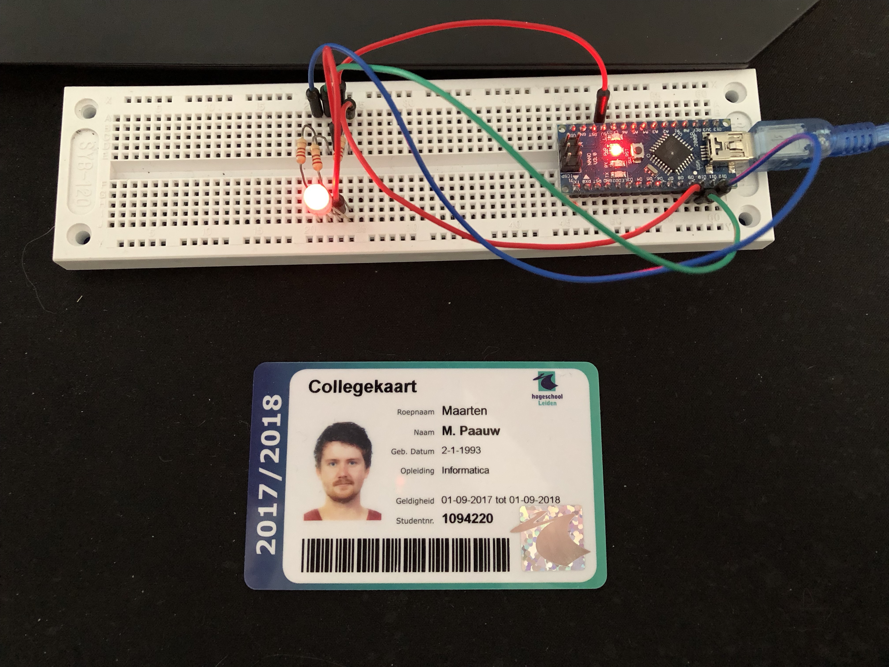

# Opdracht 4.3

> Led There Be Light

Deze opdracht bestaat uit drie kleinere opdrachten:

1. Creëer een ‘Color changing light’ met het RGB-led op basis van PWM. De PWM moet in een Interrupt Service Routine (ISR) worden afgehandeld.
2. Maak een programma waarin je via Serial communicatie een led aan of uit kan zetten. Dit mag door bijvoorbeeld het karakter ‘a’ of ‘u’ te sturen. Het programma geeft feedback over de seriële poort of het gelukt is ja of nee. Gebruik niet de gegeven usart.c en .h in je uitwerking, maar maak een oplossing in 1 source bestand.
3. **Verander deelopdracht 2 zodat binnenkomende data afgehandeld wordt in een interrupt (USART_RX_vect) zodat je programma (zoals in het voorbeeld van hoofdstuk 5) niet ‘eeuwig’ op input wacht. Toon aan dat het werkt door via seriële communicatie een ‘r’, ‘g’ of ‘b’ door te geven aan de AVR en dat dan de corresponderende kleur gaat pulseren (PWM op 1 kleur).**

## Aanpak en Uitvoering

Deze opdracht is een combinatie van opdracht [4.1][../O4_1] en [4.2][../O4_2]. De componenten zijn precies hetzelfde aangesloten als in opdracht [4.1][../O4_1]. Een van de voorwaarde van de opdracht was dat de seriele communicatie code via interrupt moest werken. Om er voor te zorgen dat deze interrupt ook werkt op input van een enkele character moest de initUSART functie iets aangepast worden. `(1 << RXCIE0)` zorgt er voor dat dit werkt.

Er zijn nu 2 ISR functies. De eerste wordt uitgevoerd als er seriele communicatie ontvangen wordt. Als dit zo is wordt de kleur aangepast (via een variabele). Ook wordt er feedback gegeven aan de gebruiker of de kleur is aangepast. De tweede functie zorgt ervoor dat de juiste kleur van de RGB LED gaat pulseren.

## Afbeelding



De afbeelding van de setup kan ook gedownload worden via de volgende link:

[https://raw.githubusercontent.com/maartenpaauw/IMTHE1/master/O4_3/assets/setup.jpg](https://raw.githubusercontent.com/maartenpaauw/IMTHE1/master/O4_3/assets/setup.jpg)

## Video

[](https://www.youtube.com/watch?v=SoOWLMDic2s)

Deze video is ook te vinden op **Youtube**:

[https://www.youtube.com/watch?v=SoOWLMDic2s](https://www.youtube.com/watch?v=SoOWLMDic2s)

## Breadboard Schema

[](https://raw.githubusercontent.com/maartenpaauw/IMTHE1/master/O4_3/assets/fritzing/schema.png)

Het **Fritzing** schema kan ook gedownload worden via de volgende link:

[https://github.com/maartenpaauw/IMTHE1/raw/master/O4_3/assets/fritzing/schema.fzz](https://github.com/maartenpaauw/IMTHE1/raw/master/O4_3/assets/fritzing/schema.fzz)

### Hardware

| Onderdelen               |
| ------------------------ |
| Arduino Nano (v3.0) - 1× |
| RGB LED - 1×             |
| 220Ω Resistor - 3×       |
| Dupont kabel - 5×        |

## Code

```c
/*
 * Opdracht 4.3 - Led There Be Light
 * 
 * Maarten Paauw <s1094220@student.hsleiden.nl>
 * s1094220
 * INF3C
 */

// Baud rate.
#define BAUD 9600

// LED pinnen.
#define LED_RED PB1
#define LED_GREEN PB2
#define LED_BLUE PB3

// Includes.
#include <avr/io.h>
#include <util/setbaud.h>
#include <avr/interrupt.h>

// Count.
int count = 0;

// Valiabele voor de kleur code (standaard rood).
char color = 'r';

// Uit het bestand USART.
void initUSART(void)
{
    UBRR0H = UBRRH_VALUE;
    UBRR0L = UBRRL_VALUE;

    #if USE_2X
        UCSR0A |= (1 << U2X0);
    #else
        UCSR0A &= ~(1 << U2X0);
    #endif

    // RXCIE0 zorgt ervoor dat de interrupt triggert op character.
    UCSR0B = (1 << RXCIE0) | (1 << TXEN0) | (1 << RXEN0);
    UCSR0C = (1 << UCSZ01) | (1 << UCSZ00);
}

// Uit het bestand USART.
uint8_t receiveByte(void)
{
    loop_until_bit_is_set(UCSR0A, RXC0);
    return UDR0;
}

// Uit het bestand USART.
void transmitByte(uint8_t data)
{
    loop_until_bit_is_set(UCSR0A, UDRE0);
    UDR0 = data;
}

// Uit het bestand USART.
void printString(const char myString[])
{
    uint8_t i = 0;
    while (myString[i])
    {
        transmitByte(myString[i]);
        i++;
    }
}

void initTimerOverflow()
{
    // Timer mask.
    TIMSK0 |= (1 << TOIE0);

    // Timer instellingen.
    TCCR0B |= (1 << CS02) | (1 << CS00);
}

void intPWMTimerLED()
{
    // Timer 1 (Voor rood en groen).
    TCCR1A |= (1 << WGM10) | (1 << WGM12); // Fast PWM.
    TCCR1B |= (1 << CS11);                 // PWM freq.

    // Timer 2 (Voor blauw).
    TCCR2A |= (1 << WGM20) | (1 << WGM21); // Fast PWM.
    TCCR2B |= (1 << CS21);                 // PWM freq.

    // Rode en groene led.
    TCCR1A |= (1 << COM1A1) | (1 << COM1B1);

    // Blauwe led.
    TCCR2A |= (1 << COM2A1);
}

// Verander de led van kleur.
void changeColor(int r, int g, int b) {

    // Verander de rode led.
    OCR1A = ~r;

    // Verander de groene led.
    OCR1B = ~g;

    // Verander de blauwe led.
    OCR2A = ~b;
}

// Zet de kleur en stuur een bericht
void setColorAndMessage(char c, char message[]) {
       
        // laat de gebruiker weten welke kleur het wordt.
        printString(message);

        // Reset de count.
        count = 0;

        // Sla het op in een variabele.
        color = c;
}

// Timer overflow interrupt.
ISR (TIMER0_OVF_vect)
{
    // Tel de count op, voor de brightness.
    count++;

    // Switch om te kijken om welke kleur het gaat.
    switch(color)
    {

        // De kleur rood.
        case 'r':

            // Verander de led kleur.
            changeColor(count, 0, 0);

            // Break de case.
            break;
        
        // De kleur groen.
        case 'g':

            // Verander de led kleur.
            changeColor(0, count, 0);

            // Break de case.
            break;

        // De kleur blauw.
        case 'b':

            // Verander de led kleur.
            changeColor(0, 0, count);

            // Break de case.
            break;
    }
}

// Als er geschreven wordt naar de seriele verbinding.
ISR (USART_RX_vect)
{
    // Kijk welke kleur het is.
    switch (UDR0)
    {

    // Als het rood is.
    case 'r':

        // Zet de kleur en laat de gebruiker weten dat de kleur rood wordt.
        setColorAndMessage('r', "De kleur wordt rood.\n");

        // Break de case.
        break;
    
    // Als het groen is.
    case 'g':

        // Zet de kleur en laat de gebruiker weten dat de kleur rood wordt.
        setColorAndMessage('g', "De kleur wordt groen.\n");

        // Break de case.
        break;

    // Als het blauw is.
    case 'b':

        // Zet de kleur en laat de gebruiker weten dat de kleur rood wordt.
        setColorAndMessage('b', "De kleur wordt blauw.\n");

        // Break de case.
        break;

    // De standaard switch case.
    default:

        // Meld aan de gebruiker dat er een toets ingedrukt moet worden.
        printString("Toets R, G of B in.\n");

        // Break de case.
        break;
    }
}

// Main methode.
int main(void)
{
    // Initialiseer de RGB LED pinnen.
    DDRB = (1 << LED_RED) | (1 << LED_GREEN) | (1 << LED_BLUE);

    // Initialiseer de USART.
    initUSART();

    // Initialiseer de overflow timer.
    initTimerOverflow();

    // Initialiseer de led timer.
    initPWMTimerLED();

    // Zet de interrupts aan.
    sei();

    // Loop voor altijd.
    while (1)
    {
    }

    // Geef niets terug.
    return 0;
}
```

De code kan ook gevonden worden in mijn **GitHub** *repository* via de volgende link:

[https://github.com/maartenpaauw/IMTHE1/blob/master/O4_3/src/main.c](https://github.com/maartenpaauw/IMTHE1/blob/master/O4_3/src/main.c)


### Arduino Nano Pinout


De [Arduino Nano Pinout][1] is uitgedeeld tijdens de eerste les en terug te vinden via het volgende forum post:

[https://forum.arduino.cc/index.php?topic=147582.0][1]

### RGB LED Pinout


De [RGB LED Pinout][2] heb ik gevonden op het internet door te Googelen op afbeeldingen en kan terug gevonden worden via de volgende link:

[https://i1.wp.com/wiki.jmoon.co/wp-content/uploads/2015/07/rgb-2.jpg][2]

## Bronvermelding

* [https://forum.arduino.cc/index.php?topic=147582.0][1] (Arduino Nano Pinout)
* [http://eeenthusiast.com/wp-content/uploads/2015/03/rgb.jpg][2] (RGB LED Pinout)

[1]: https://forum.arduino.cc/index.php?topic=147582.0 "Arduino Nano Pinout"
[2]: http://eeenthusiast.com/wp-content/uploads/2015/03/rgb.jpg "RGB LED (Common Cathode) Pinout"
