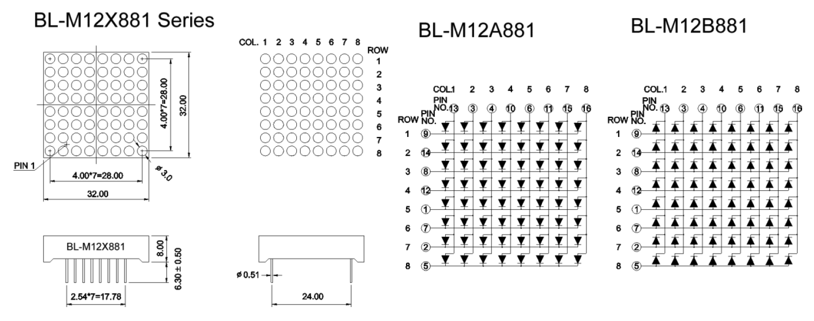

# Opdracht 5.1

> ET Phone Home

Deze opdracht bestaat uit twee kleinere opdrachten:

1. **Elke IMTHE-Box bevat unieke componenten. Zoek naar de datasheets van deze componenten en maak een kort verslag per component over de protocollen die gebruikt worden en hoe je dit moet gebruiken vanuit de AVR code.**
2. Zoek naar een library op internet om het HD44780 display te kunnen besturen en maak een programma dat jouw naam en studentnummer op het display laat zien.

## De unieke componenten

In de IMTHE-Box zitten 2 unieke componenten. Één uniek input component en één uniek output component. 

De compontent die ik heb zijn hieronder opgenomen in de tabel.

### Hardware

| Onderdelen               |
| ------------------------ |
| 8×8 Matrix (output) - 2× |
| DHT11(input) - 1×        |

## Datasheet

### 8×8 Matrix Pinout

De [8×8 Matrix Pinout][1] heb ik via Google gevonden en is terug te vinden via de volgende link:

[https://www.arduino.cc/en/Tutorial/RowColumnScanning][1]

### DHT11 Pinout

De [DHT11 Pinout][2] heb ik via Google gevonden en is terug te vinden via de volgende link:

[https://components101.com/dht11-temperature-sensor][2]

## Bronvermelding

* [https://www.arduino.cc/en/Tutorial/RowColumnScanning][1] (8×8 Matrix Pinout)
* [https://components101.com/dht11-temperature-sensor][2] (DHT11 Pinout)

[1]: https://www.arduino.cc/en/Tutorial/RowColumnScanning "8×8 Matrix Pinout"
[2]: https://components101.com/dht11-temperature-sensor "DHT11 Pinout"
