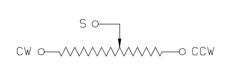

# Opdracht 5.2

> ET Phone Home

Deze opdracht bestaat uit twee kleinere opdrachten:

1. Elke IMTHE-Box bevat unieke componenten. Zoek naar de datasheets van deze componenten en maak een kort verslag per component over de protocollen die gebruikt worden en hoe je dit moet gebruiken vanuit de AVR code.
2. **Zoek naar een library op internet om het HD44780 display te kunnen besturen en maak een programma dat jouw naam en studentnummer op het display laat zien.**

## Aanpak en Uitvoering

Om het display werkend te krijgen mocht ik gebruik maken van een library. Na een tijdje Googelen kwam ik terrecht bij een post op het forum van Atmel. De post ging over een library die gemaakt was voor dit display. De library had ook een settings bestand. Hier moesten aan aantal variabelen aangepast worden. Dit waren pin nummers, CPU snelheid en het aantal bits. Dit instellingen zijn opgenomen in het hoofdstuk code. Via een andere blogpost kwam ik erachter hoe ik de pinnen moest aansluiten en dat er een potentiometer nodig was. 

De code zelf is vrij kort. Er zijn maar een aantal functies die aangeroepen hoeven worden:

* Een functie die het display initialiseert.
* Een functie die het display leeg maakt.
* Een functie die mijn naam op de eerste regel zet.
* Een functie die er voor zorgt dat er geschreven kan worden op de tweede regel.
* Een functie die mijn studentnummer op de tweede regel zet.

Al deze code staat buiten de loop omdat het maar één keer op het scherm gezet hoeft te worden. Deze code kan terug gevonden worden in het hoofdstuk code.

## Afbeelding


De afbeelding van de setup kan ook gedownload worden via de volgende link:

[https://raw.githubusercontent.com/maartenpaauw/IMTHE1/master/O5_2/assets/setup.jpg](https://raw.githubusercontent.com/maartenpaauw/IMTHE1/master/O5_2/assets/setup.jpg)

## Video

[](https://www.youtube.com/watch?v=F5fXDvtFF8w)

Deze video is ook te vinden op **Youtube**:

[https://www.youtube.com/watch?v=F5fXDvtFF8w](https://www.youtube.com/watch?v=F5fXDvtFF8w)

## Breadboard Schema

[](https://raw.githubusercontent.com/maartenpaauw/IMTHE1/master/O5_2/assets/fritzing/schema.png)

Het **Fritzing** schema kan ook gedownload worden via de volgende link:

[https://github.com/maartenpaauw/IMTHE1/raw/master/O5_2/assets/fritzing/schema.fzz](https://github.com/maartenpaauw/IMTHE1/raw/master/O5_2/assets/fritzing/schema.fzz)

### Hardware

| Onderdelen               |
| ------------------------ |
| Arduino Nano (v3.0) - 1× |
| LCD Scherm - 1×          |
| Potentiometer - 1×       |
| Dupont Kabel - 14×       |

## Code

```c
/*
 * Opdracht Opdracht 5.2 - ET Phone Home
 * 
 * Maarten Paauw <s1094220@student.hsleiden.nl>
 * s1094220
 * INF3C
 */
#include "hd44780.h"
#include <util/delay.h>

// Mijn naam.
#define NAAM "Maarten Paauw"

// Mijn studentnummer.
#define STUDENTNUMMER "s1094220"

int main(void)
{
    // Initialiseer het LCD display.
    lcd_init();

    // Maak het LCD display leeg.
    lcd_clrscr();
    
    // Schrijf mijn naam op de eerste regel.
    lcd_puts(NAAM);

    // Ga naar de tweede regel.
    lcd_goto(0x40);

    // Schrijf mijn studentnummer op de tweede regel.
    lcd_puts(STUDENTNUMMER);

    // Loop voor altijd.
    while (1) { }

    // Geef 0 terug.
    return 0;
}
```

De code kan ook gevonden worden in mijn **GitHub** *repository* via de volgende link:

[https://github.com/maartenpaauw/IMTHE1/blob/master/O5_2/src/main.c](https://github.com/maartenpaauw/IMTHE1/blob/master/O5_2/src/main.c)

### Library

De library die ik gebruikt heb heeft ook een aantal instellingen nodig. De instellingen heb ik hieronder opgenomen.

```c
#ifndef HD44780_SETTINGS_H

  #define HD44780_SETTINGS_H

  #define F_CPU                    16000000    // Set Clock Frequency

  #define USE_ADELAY_LIBRARY       0           // Set to 1 to use my ADELAY library, 0 to use internal delay functions
  #define LCD_BITS                 4           // 4 for 4 Bit I/O Mode, 8 for 8 Bit I/O Mode
  #define RW_LINE_IMPLEMENTED      0           // 0 for no RW line (RW on LCD tied to ground), 1 for RW line present
  #define WAIT_MODE                0           // 0=Use Delay Method (Faster if running <10Mhz)
                                              // 1=Use Check Busy Flag (Faster if running >10Mhz) ***Requires RW Line***
  #define DELAY_RESET              15          // in mS

  #if (LCD_BITS==8)                            // If using 8 bit mode, you must configure DB0-DB7
    #define LCD_DB0_PORT           PORTC
    #define LCD_DB0_PIN            0
    #define LCD_DB1_PORT           PORTC
    #define LCD_DB1_PIN            1
    #define LCD_DB2_PORT           PORTC
    #define LCD_DB2_PIN            2
    #define LCD_DB3_PORT           PORTC
    #define LCD_DB3_PIN            3
  #endif

  #define LCD_DB4_PORT             PORTC       // If using 4 bit omde, yo umust configure DB4-DB7
  #define LCD_DB4_PIN              0
  #define LCD_DB5_PORT             PORTC
  #define LCD_DB5_PIN              1
  #define LCD_DB6_PORT             PORTC
  #define LCD_DB6_PIN              2
  #define LCD_DB7_PORT             PORTC
  #define LCD_DB7_PIN              3

  #define LCD_RS_PORT              PORTC       // Port for RS line
  #define LCD_RS_PIN               4           // Pin for RS line

  #define LCD_RW_PORT              PORTC       // Port for RW line (ONLY used if RW_LINE_IMPLEMENTED=1)
  #define LCD_RW_PIN               6           // Pin for RW line (ONLY used if RW_LINE_IMPLEMENTED=1)

  #define LCD_DISPLAYS             1           // Up to 4 LCD displays can be used at one time
                                              // All pins are shared between displays except for the E
                                              // pin which each display will have its own

                                              // Display 1 Settings - if you only have 1 display, YOU MUST SET THESE
  #define LCD_DISPLAY_LINES        2           // Number of Lines, Only Used for Set I/O Mode Command
  #define LCD_E_PORT               PORTC       // Port for E line
  #define LCD_E_PIN                5           // Pin for E line

  #if (LCD_DISPLAYS>=2)                        // If you have 2 displays, set these and change LCD_DISPLAYS=2
    #define LCD_DISPLAY2_LINES     2           // Number of Lines, Only Used for Set I/O Mode Command
    #define LCD_E2_PORT            PORTC       // Port for E line
    #define LCD_E2_PIN             5           // Pin for E line
  #endif

  #if (LCD_DISPLAYS>=3)                        // If you have 3 displays, set these and change LCD_DISPLAYS=3
    #define LCD_DISPLAY3_LINES     2           // Number of Lines, Only Used for Set I/O Mode Command
    #define LCD_E3_PORT            PORTC       // Port for E line
    #define LCD_E3_PIN             5           // Pin for E line
  #endif

  #if (LCD_DISPLAYS>=4)                        // If you have 4 displays, set these and change LCD_DISPLAYS=4
    #define LCD_DISPLAY4_LINES     2           // Number of Lines, Only Used for Set I/O Mode Command
    #define LCD_E4_PORT            PORTC       // Port for E line
    #define LCD_E4_PIN             5           // Pin for E line
  #endif

#endif
```

De code kan ook gevonden worden in mijn **GitHub** *repository* via de volgende link:

[https://github.com/maartenpaauw/IMTHE1/blob/master/O5_2/lib/hd44780/hd44780_settings.h](https://github.com/maartenpaauw/IMTHE1/blob/master/O5_2/lib/hd44780/hd44780_settings.h)

## Datasheet

### Arduino Nano Pinout


De [Arduino Nano Pinout][1] is uitgedeeld tijdens de eerste les en terug te vinden via het volgende forum post:

[https://forum.arduino.cc/index.php?topic=147582.0][1]

### HD44780 Pinout


De [HD44780 Pinout][3] heb ik gevonden via een blogpost die terug te vinden is via de volgende link:

### Potentiometer Pinout



De [Potentiometer Pinout][4] heb ik gevonden op Google en is terug te vinden via de volgende link:

[https://cdn-learn.adafruit.com/assets/assets/000/027/586/original/light_control-pot.png][4]

http://www.learningaboutelectronics.com/Articles/Arduino-HD44780-circuit.php

## Bronvermelding

* [https://forum.arduino.cc/index.php?topic=147582.0][1] (Arduino Nano Pinout)
* [https://community.atmel.com/projects/hd44780-library][2] (HD44780 Library)
* [http://www.learningaboutelectronics.com/Articles/Arduino-HD44780-circuit.php][3] (Arduino HD44780 Circuit)
* [https://cdn-learn.adafruit.com/assets/assets/000/027/586/original/light_control-pot.png][4] (Potentiometer Pinout)

[1]: https://forum.arduino.cc/index.php?topic=147582.0 "Arduino Nano Pinout"
[2]: https://community.atmel.com/projects/hd44780-library "HD44780 Library"
[3]: http://www.learningaboutelectronics.com/Articles/Arduino-HD44780-circuit.php "Arduino HD44780 Circuit"
[4]: https://cdn-learn.adafruit.com/assets/assets/000/027/586/original/light_control-pot.png "Potentiometer Pinout"